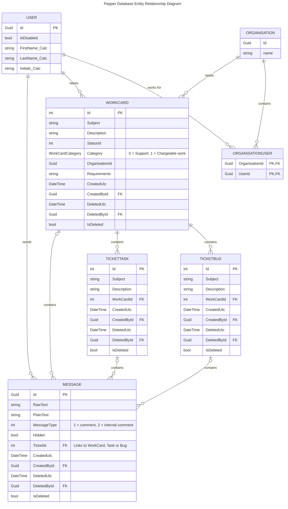
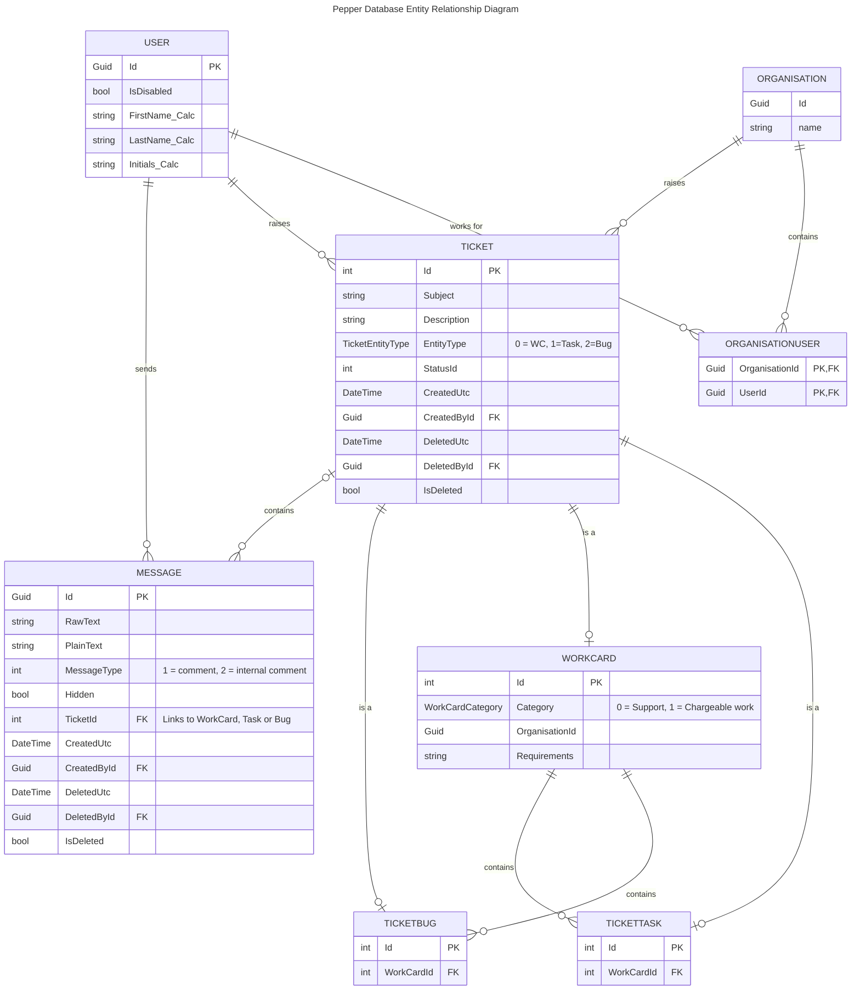
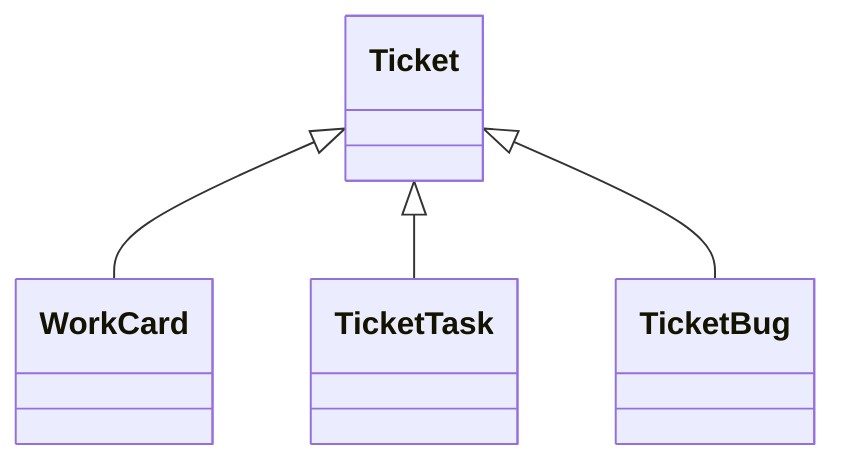
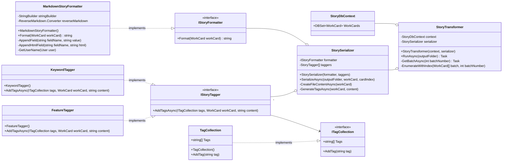

Date: Friday, April 05, 2024
# Work Undertaken Summary


# Risks
TMA02 deadline fast approaching, focus shifting to TMA work

# Time Spent
1hr TMA02
1hr research understanding transformers
1.5hr Pepper Diagram
1hr StoryTransformer Dev work (Tagging)
1.5hr StoryTransformer Diagram
1.25hr infini-attention papper
0.5 update schedule

# Questions for Tutor


# Next work planned
```
- [If you are registered in a Computing and IT (Honours degree) specialist route]
    
    Will the solution be within the specialism route of my degree?
```

I'm not on a degree specialisation, I assume a statement in the report would be useful?

# Raw Notes


# TMA02

- TMA02 Assignment [TMA 02 Review of Work in Progress: 2 Project activities | OU online (open.ac.uk)](https://learn2.open.ac.uk/mod/oucontent/view.php?id=2266289&section=2)
- Resource map contains useful links for each submission:
[Resource Map | OU online (open.ac.uk)](https://learn2.open.ac.uk/mod/oucontent/view.php?id=2217310)

TODO continue from here: [TMA 02 Review of Work in Progress: 3.1 Preparation and planning | OU online (open.ac.uk)](https://learn2.open.ac.uk/mod/oucontent/view.php?id=2266289&section=3.1)

# Pepper Database Diagram First Attempt

https://mermaid.js.org/syntax/entityRelationshipDiagram.html
# Pepper Diagram second attempt


The ticketing system used by my employer is an in house product called Pepper. Pepper handles both support requests and normal feature development. This diagram is a slice of the system that is important to my project.

The pepper system uses inheritance as part of its modelling. The Ticket type is an abstract class from which WorkCard, TicketBug, TicketTask derive. They are all stored in the same database table using the Table-per-hierarchy pattern ([Inheritance - EF Core | Microsoft Learn](https://learn.microsoft.com/en-us/ef/core/modeling/inheritance#table-per-hierarchy-and-discriminator-configuration)). This design choice was to enable bugs and tasks to be easily promoted into their own independent work cards.



# Story Transformer


I've designed the system to be very modular to allow for rapid experimentation / flexibility / iteration.

Most items interact only via an interface to allow bits to be swapped out.

Most items use dependency injection, inversion of control to allow for wider use / top level configuration.

Added ITagCollection to allow for logic in the adding of tags, e.g. synonyms or deduplication of tags.

The tag generation is done via an IStoryTagger interface, this allows breaking up of the logic associated with generating the tags. E.g. KeywordTagger adds tags based off the presence of keywords, FeatureTagger exploits the structured information from pepper about which feature it was assigned to. A future tagger could call off to an LLM to categorize the card. 