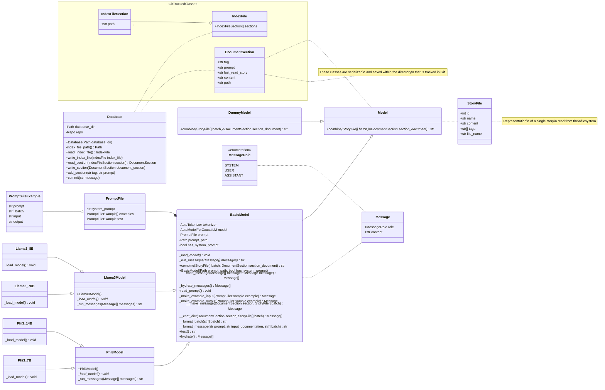
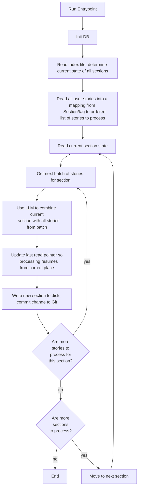

Date: Wednesday, June 26, 2024
# Work Undertaken Summary

# Risks

# Time Spent
0.75 TMA03
5hr TMA03
1hr Reading - "What we learned from a year of building with LLM's"
2.75hr TMA03
0.25 Reading - "phi3 update"
0.75 TMA03 - Main loop diagram
# Questions for Tutor

# Next work planned
Complete reading section then move on to project work.

New Dev Work: Try updated phi3-mini with much improved long context scores. Might not get stuck in a loop.
[microsoft/Phi-3-mini-128k-instruct · Hugging Face](https://huggingface.co/microsoft/Phi-3-mini-128k-instruct#release-notes)
![[Pasted image 20240702135313.png]]

# Raw Notes

# StoryWeaver UML

