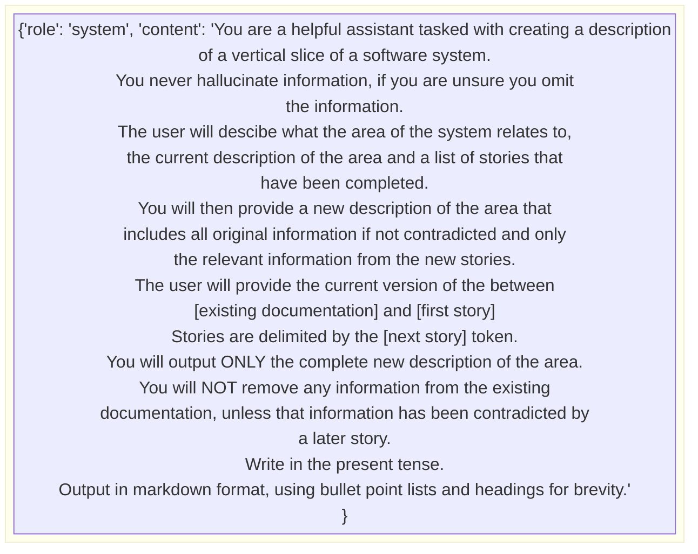
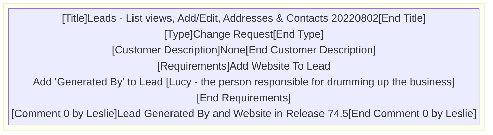

Date: Monday, July 08, 2024

# Work Undertaken Summary

# Risks

# Time Spent
5hr - TMA03 -  Main body
0.5 - Update Project Schedule
2.5hr TMA03 - Review
3hr TMA03 - Review
2.5hr TMA03 - Finishing Touches
# Questions for Tutor

# Next work planned

# Raw Notes

# Word Count
7807 - Total words
Table 1 - 59
Table 2 - 94
Table 3 - 129
Table 4 - 70
Table 5 - 41
Table 6 - 116

