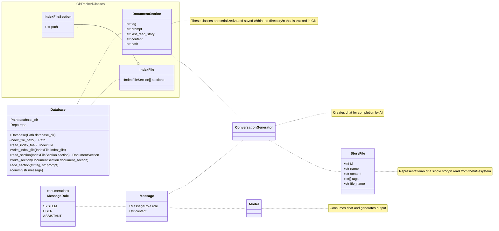
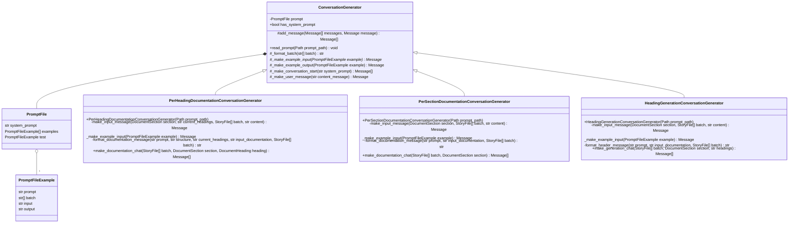
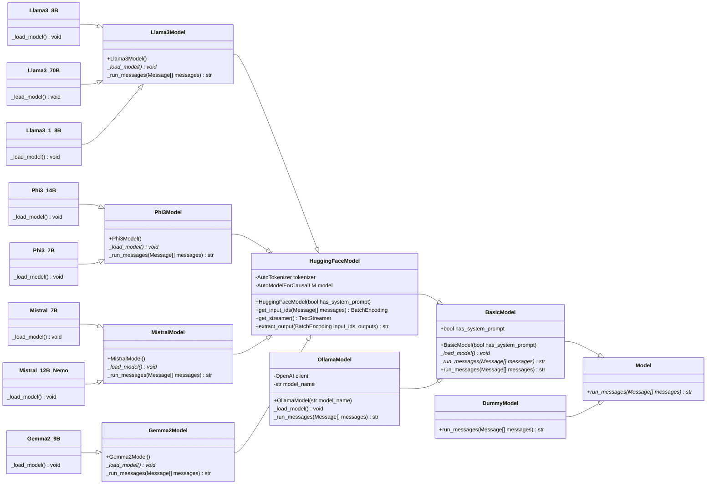

Date: Wednesday, August 21, 2024

# Time Spent
1.25hr Story Weaver Development
0.5hr EMA Tutorial
1.5 hr Update story weaver class diagram.

# Questions for Tutor


# Next work planned

- [x] Update the model to have HuggingFaceModel in the middle of the chain and add ollama. and the text generation changes.
- [ ] Review the EMA submission details again and start writing the report.

# Raw Notes

## Cleanup
Cleaned up and documented the code for StoryWeaver. All available at:
https://github.com/LukeThoma5/StoryWeaver/tree/EMA


## CLI Interface
```
python3 ./weaver.py --help
Usage: weaver.py [OPTIONS] COMMAND [ARGS]...

Options:
  --help  Show this message and exit.

Commands:
  add-section           Add a new section to the database
  approve-headings      Approve the headings after potential human...
  document-per-heading  The main entry point, use AI to generate...
  document-per-section  The main entry point, use AI to generate...
  export-book           Export the documentation to a single markdown file
  export-chat           Export conversation of a complete chat that...
  generate-headings     Use AI to generate headings for the documentation
  init                  Initialize the database directory
```

```
python3 ./weaver.py document-per-section --help
Usage: weaver.py document-per-section [OPTIONS]

  The main entry point, use AI to generate documentation from the input folder
  and store it in the database folder, a section at a time

Options:
  --staging_dir TEXT   [required]
  --database_dir TEXT  [required]
  --help               Show this message and exit.
```

# Top Level Diagram

# Chat Generation Diagram


# Model Diagram

